<h1 align="center">hey, i'm Luke 👋</h1>

  

  <a href="mailto:luke@megaluke.de">luke@megaluke.de</a> &nbsp;·&nbsp; NRW, Germany

---

I build things. Usually because they don't exist yet, or because they exist but aren't fun enough.

Right now I'm deep in ESP32 firmware — a wearable e-ink keychain showing live transit departures, with OTA updates, deep-sleep wake stubs, and a full web portal behind it. I don't know how to stop adding features.

I used to volunteer at gaming fairs and got tired of watching crews run on spreadsheets, so I built [Crewvolution](https://crewvolution.com). Real product, real people use it.

Next thing I want to build: an open-source modular robot arm. Still on my desk in pieces.

---

### things i've built

| | |
|---|---|
| [DepartureMonitor](https://github.com/Luke1505/DepartureMonitor) | ESP32 e-ink keychain — live transit, OTA, full web portal |
| [Crewvolution](https://crewvolution.com) | crew scheduling for events — born at a gaming fair |
| [MultClient](https://github.com/Luke1505/MultClient) | silent Windows installer with `mult://` protocol and tray UI |
| [MCED](https://github.com/MinecraftEvolve/MCED) | desktop config editor for Minecraft mod packs |
| PoolDevice | Pi pool controller — my dad wanted the hot tub on his phone |

---

### tools i actually use

  

---

  
  &nbsp;
  

  

